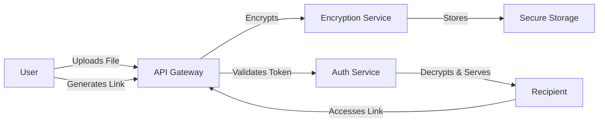

# SecureDoc - Secure Document Sharing Platform

## 📌 Executive Summary

**SecureDoc** is a secure document sharing and storage platform designed for high-compliance industries. It enables users to store sensitive files and share them via time-bound, encrypted links or QR codes.

**Core Value Proposition:**
*   **End-to-End Encryption**: Files are encrypted at rest and in transit.
*   **Ephemeral Sharing**: Shared links expire automatically after a set duration.
*   **Access Control**: Granular permissions (View, Edit, Download) for shared content.

---

## 📂 Documentation Hub

The documentation for this project is organized into the following modules:

| Document | Description |
| :--- | :--- |
| **[Project Overview](./documentation/01_Project_Overview.md)** | High-level vision, target audience, and market analysis. |
| **[System Requirements](./documentation/02_Requirements.md)** | Detailed BRD covering functional and non-functional needs. |
| **[Architecture](./documentation/03_Architecture.md)** | System design, encryption flows, and cloud infrastructure. |
| **[Security & Risks](./documentation/04_Security_and_Risks.md)** | Security risks, mitigation strategies, and compliance check. |

---

## 🏗️ System Architecture

---

## 🚀 Integration Guide

For developers integrating with SecureDoc SDK:
1.  Initialize the client with your `API_KEY`.
2.  Call `uploadDocument(file)` to get a `docId`.
3.  Call `generateShareLink(docId, expiry)` to get a shareable URL.
