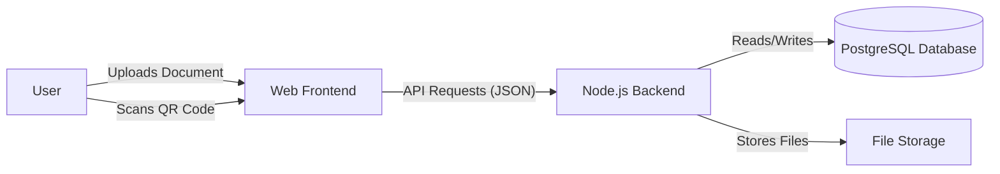
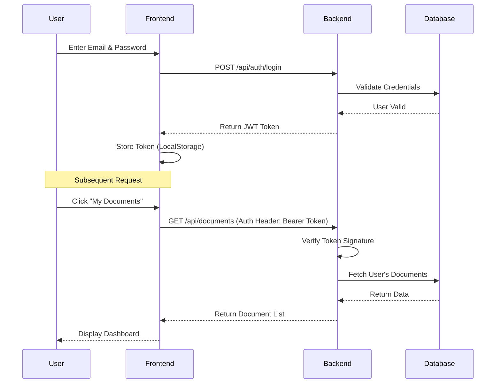
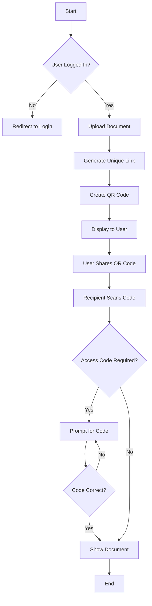

# Architecture & Workflow Diagrams

## 1. System Context Diagram
This diagram shows the high-level interaction between the user and the SecureDoc system.

## 2. Authentication Flow (JWT)
This sequence diagram illustrates the login process and token usage.

## 3. Document Sharing Workflow
This flowchart describes the process of sharing a document via QR code.

