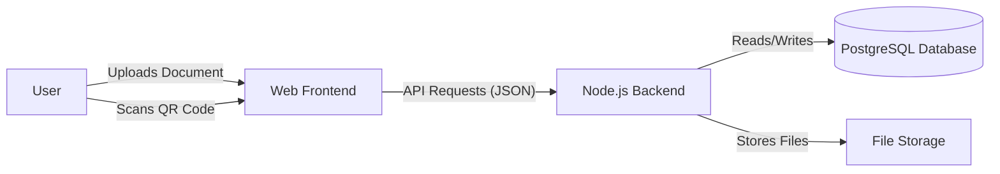
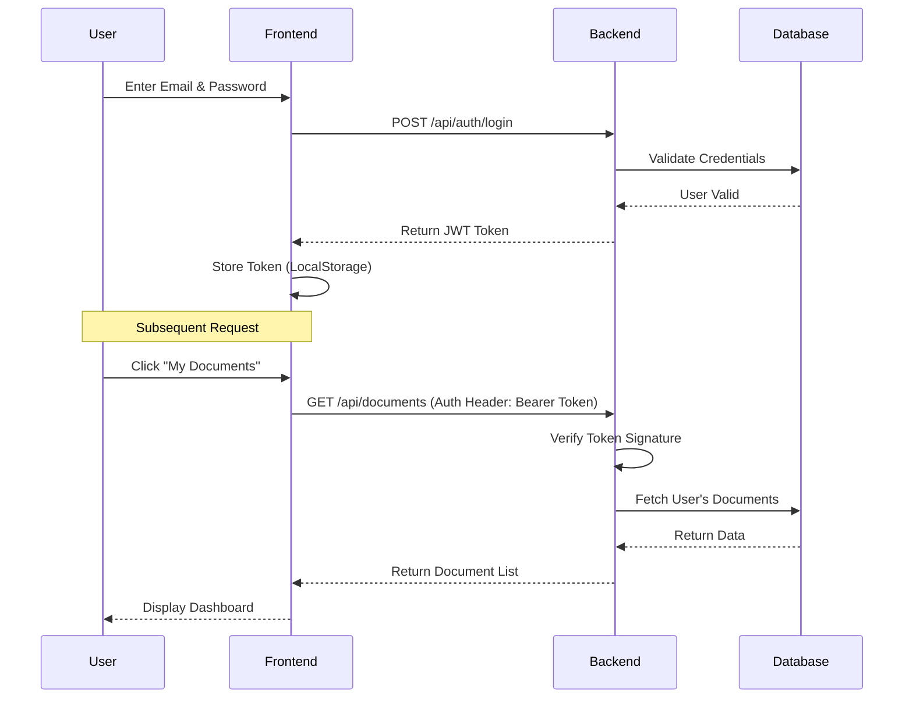

# Architecture & Design

## 1. System Context Diagram
This diagram shows the high-level interaction between the user and the SecureDoc system.



## 2. Authentication Flow (JWT)
This sequence diagram illustrates the login process and token usage.



## 3. Document Sharing Workflow
This flowchart describes the process of sharing a document via QR code.

```mermaid
flowchart TD
    A[Start] --> B{Scanner is Owner?}
    
    %% Owner Flow
    B -- Yes --> C[Prompt for PIN]
    C --> D{PIN Correct?}
    D -- Yes --> E[Show All Documents]
    D -- No --> C
    
    %% Guest Flow
    B -- No --> F[Show Document Hub]
    F --> G[Guest Fills Form (Name, Email, Phone)]
    G --> H[Guest Selects Documents]
    H --> I[Send Access Request]
    I --> J[Owner Receives Notification]
    J --> K{Owner Approves?}
    K -- Yes --> L[Select Permission (View/Download)]
    L --> M[Send Access Link to Guest]
    M --> N[Guest Accesses Selected Docs]
    K -- No --> O[Request Denied]
    
    E --> P[End]
    N --> P
    O --> P
```
